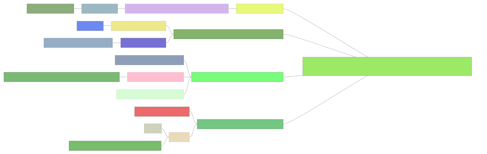
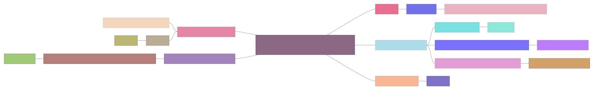
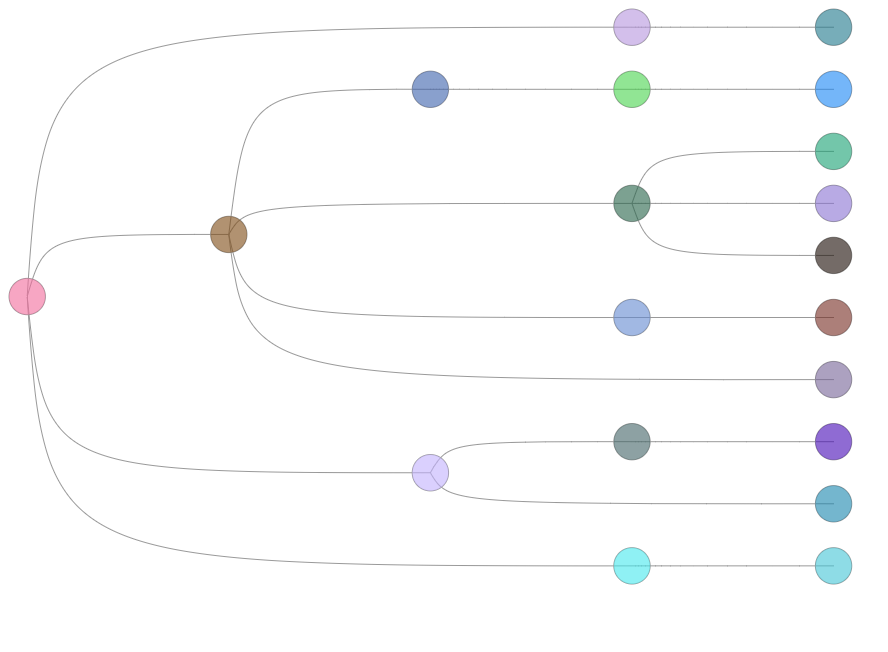
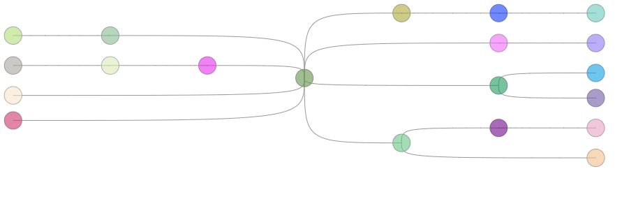
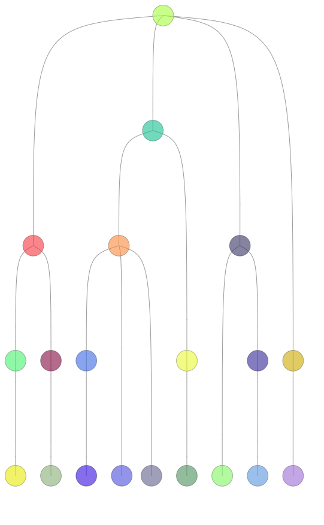
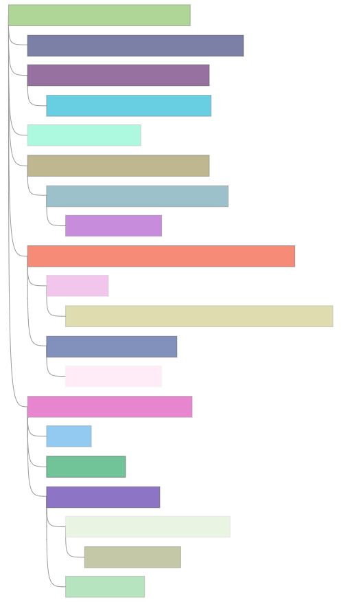
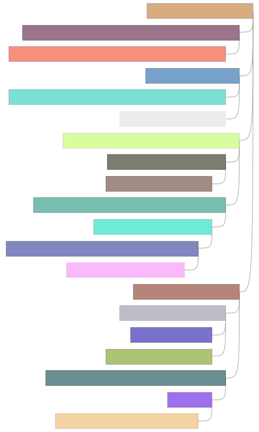
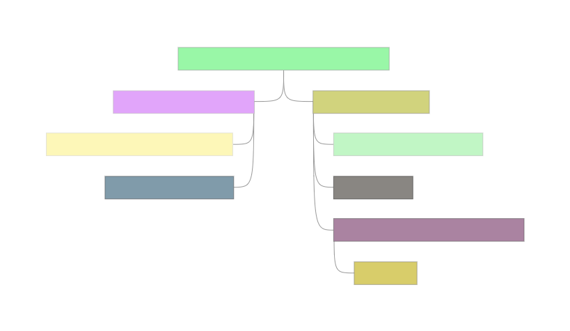
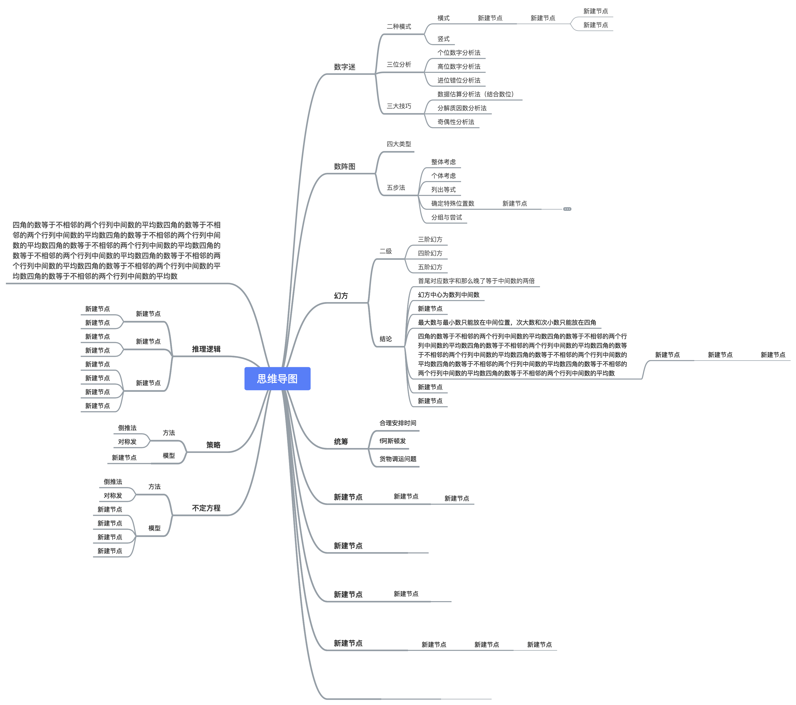

# hierarchy

layout algorithms for visualizing hierarchical data.

## API

### example

```js
const Hierarchy = require('@antv/hierarchy');

// your tree data
const root = {
  isRoot: true,
  id: 'Root',
  children: [
    {
      id: 'SubTreeNode1',
      children: [
        {
          id: 'SubTreeNode1.1'
        },
        {
          id: 'SubTreeNode1.2'
        }
      ]
    },
    {
      id: 'SubTreeNode2'
    }
  ]
};

// apply layout
const NODE_SIZE = 16;
const PEM = 5;
const ctx = document.getElementById('id-of-canvas-element').getContext('2d');
const rootNode = Hierarchy.compactBox(root, {
  direction: 'H', // H / V / LR / RL / TB / BT
  getId(d) {
    return d.id;
  },
  getHeight(d) {
    if (d.isRoot) {
      return NODE_SIZE * 2;
    }
    return NODE_SIZE;
  },
  getWidth(d) {
    if (d.isRoot) {
      return ctx.measureText(d.id).width * 2 + PEM * 1.6;
    }
    return ctx.measureText(d.id).width + PEM * 1.6;
  },
  getHGap(d) {
    if (d.isRoot) {
      return PEM * 2;
    }
    return PEM;
  },
  getVGap(d) {
    if (d.isRoot) {
      return PEM * 2;
    }
    return PEM;
  },
  getSubTreeSep(d) {
    if (!d.children || !d.children.length) {
      return 0;
    }
    return PEM;
  }
});
```

### layout types

`Hierarchy[type]`

#### compactBox

this layout differs from `d3-hierarcy.tree`, it is a compact box tidy layout that is tidy in both horizontal and vertical directions.

> demos

| LR | RL | H |
| -------- | -------- | -------- |
|  |  |  |

| TB | BT | V |
| -------- | -------- | -------- |
|  |  |  |

#### dendrogram

> demos

| LR | RL | H |
| -------- | -------- | -------- |
|  |  |  |

| TB | BT | V |
| -------- | -------- | -------- |
|  |  |  |

#### indented

> demos

| LR | RL | H |
| -------- | -------- | -------- |
|  |  |  |

#### mindmap

this layout is inspired by XMind. 

> demos


