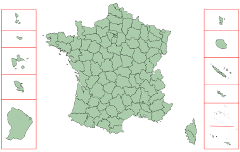

# d3-composite-projections

Set of d3 projections for showing countries' distant lands together

USAGE
=====

This is the version compatible with d3v4, please [go here for the version compatible with d3v3](https://github.com/rveciana/d3-composite-projections/tree/v0.4.0).

The projection itself works the same way as the other d3 projections. To be more precise, exactly as the [albersUsa](https://github.com/mbostock/d3/wiki/Geo-Projections#albersUsa) projection:

    
    
    var projection = d3.geoConicConformalPortugal();

Change the scale using scale i.e. `.scale(3000)`, as usual. The projections are prepared to fit a 960x500px SVG or Canvas.

The projection is available for:

* USA: [geoAlbersUSA](http://bl.ocks.org/rveciana/ee2119324e835e1bad42d0e4c1b9ab0d)
* USA Territories: [geoAlbersUsaTerritories](http://bl.ocks.org/rveciana/5040be82aea528b6f785464f8816690f) as albersUsa, but adding the American Samoa, Puerto Rico, U.S. Virgin Islands, Guam and Northern Marianas Islands, so all the [Congressional Districts](https://en.wikipedia.org/wiki/List_of_districts_of_the_House_of_Representatives_of_Japan) are represented
* France: [geoConicConformalFrance](http://bl.ocks.org/rveciana/0ff189b15449330828605fe4e118a716)
* Portugal: [geoConicConformalPortugal](http://bl.ocks.org/rveciana/ee09a2c3732f3e0d6872d1a7f796a29b)
* Spain: [geoConicConformalSpain](http://bl.ocks.org/rveciana/d635afded8c4eae36ecf61a15bdf0a98)
* Europe: [geoConicConformalEurope](http://bl.ocks.org/rveciana/ced3109b372039afbcf7278ba3d14250) (thought for Eurostat data)
* Japan: [geoConicEquidistantJapan](http://bl.ocks.org/rveciana/1f5399d8887428ad67665d106ec089d1)
* Ecuador: [geoMercatorEcuador](http://bl.ocks.org/rveciana/306a5202e1facf7a22e08fbb1044f568)
* Chile: [geoTransverseMercatorChile](http://bl.ocks.org/rveciana/3a31865e82f4fab8ac2522545bbc7741), including the [Chilean Antarctic Territory](https://en.wikipedia.org/wiki/Chilean_Antarctic_Territory)
* Malaysia: [geoMercatorMalaysia](http://bl.ocks.org/rveciana/6298dd3e71cf98b6930c06f19b6684a2), created with the help of [Saiful Azfar Ramlee](https://github.com/saifulazfar)
* Equatorial Guinea [geoMercatorEquatorialGuinea](http://bl.ocks.org/rveciana/4dfc136b8e2707f182aa4591f892f82e)

To draw the borders between the projection zones, use `getCompositionBorders()` for SVG:

    svg.append("path")
     .style("fill","none")
     .style("stroke","#000")
     .attr("d", path(projection.getCompositionBorders()));

or drawCompositionBorders if using Canvas:

   projection.drawCompositionBorders(context);

 Using with node
 ---------------

    var d3_composite = require("d3-composite-projections");
    var d3_geo = require("d3-geo");
    var projection = d3_composite.geoAlbersUsaTerritories();

INSTALLATION
============

Getting the files
-----------------

You can get the files just by cloning the repository:

  git clone https://github.com/rveciana/d3-composite-projections.git

or downloading the *d3-composite-projections.js* or *d3-composite-projections.min.js* files.

Using cdnjs or unpkg
--------------------

You can link the files from your web page to [cdnjs](https://cdnjs.com/libraries/d3-composite-projections):

    

or

    

Using NPM
---------

    npm install d3-composite-projections

This will download all the dependencies, the test files.

Running the tests
-----------------

The tests can be run using:

    npm test
